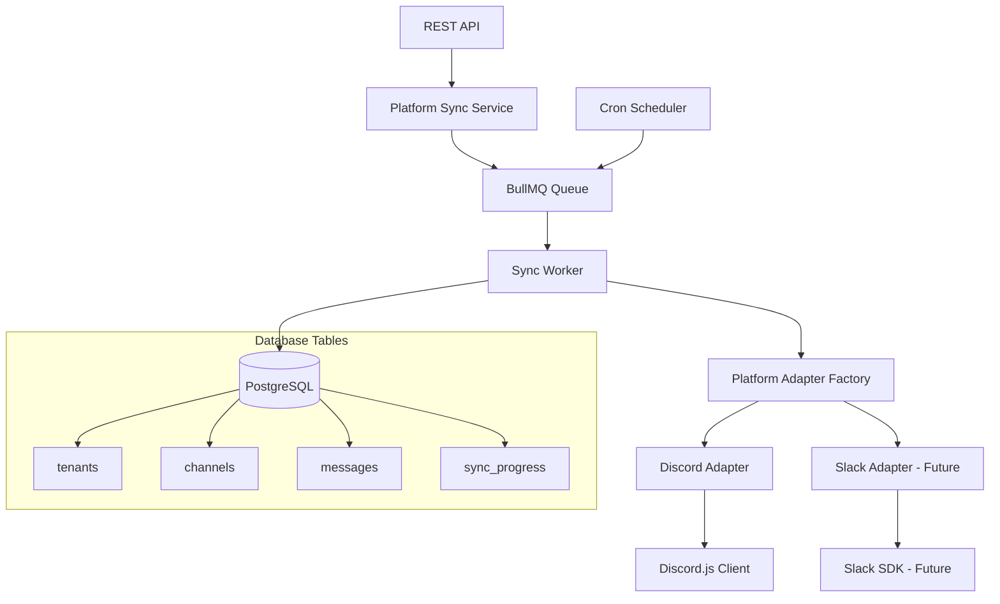

# Platform Sync Feature Design

## Overview

The Platform Sync feature extends Verta's multi-tenant system to automatically archive messages from tenant-connected platforms (Discord, Slack). The system uses BullMQ for job orchestration, platform-specific adapters for API integration, and implements a resilient sync mechanism that can recover from interruptions while maintaining data privacy through user ID anonymization. This design supports multiple platforms through a pluggable adapter architecture.

## Architecture

### High-Level Components



### Data Flow

1. **Scheduled Sync**: Hourly cron job queues sync jobs for all platform tenants
2. **Manual Sync**: API endpoint queues immediate sync job for specific tenant
3. **New Tenant**: Tenant creation triggers immediate initial sync
4. **Job Processing**: BullMQ worker processes sync jobs sequentially
5. **Platform Integration**: Worker uses appropriate adapter (Discord/Slack) to fetch data
6. **Data Storage**: Platform-agnostic data stored in PostgreSQL with progress tracking

## Components and Interfaces

### 1. Database Schema Extensions

#### Channels Table (Platform-Agnostic)

```sql
CREATE TABLE channels (
  id UUID PRIMARY KEY DEFAULT gen_random_uuid(),
  tenant_id UUID NOT NULL REFERENCES tenants(id) ON DELETE CASCADE,
  platform_id VARCHAR(64) NOT NULL, -- Platform-specific channel ID
  name VARCHAR(255) NOT NULL,
  type VARCHAR(20) NOT NULL, -- 'text', 'thread', 'forum'
  parent_channel_id VARCHAR(64), -- For threads/forum posts
  topic TEXT,
  platform_metadata JSONB, -- Platform-specific data
  created_at TIMESTAMP NOT NULL DEFAULT NOW(),
  updated_at TIMESTAMP NOT NULL DEFAULT NOW(),

  UNIQUE(tenant_id, platform_id),
  INDEX idx_channels_tenant_id (tenant_id),
  INDEX idx_channels_type (type),
  INDEX idx_channels_platform_metadata USING GIN (platform_metadata)
);
```

#### Messages Table (Platform-Agnostic)

```sql
CREATE TABLE messages (
  id UUID PRIMARY KEY DEFAULT gen_random_uuid(),
  tenant_id UUID NOT NULL REFERENCES tenants(id) ON DELETE CASCADE,
  channel_id UUID NOT NULL REFERENCES channels(id) ON DELETE CASCADE,
  platform_id VARCHAR(64) NOT NULL, -- Platform-specific message ID
  author_hash VARCHAR(64) NOT NULL, -- Anonymized user ID
  content TEXT,
  message_type VARCHAR(20) DEFAULT 'default',
  reply_to_id VARCHAR(64), -- Parent message platform ID for replies
  platform_created_at TIMESTAMP NOT NULL,
  platform_metadata JSONB, -- Platform-specific data
  created_at TIMESTAMP NOT NULL DEFAULT NOW(),

  UNIQUE(tenant_id, platform_id),
  INDEX idx_messages_tenant_channel (tenant_id, channel_id),
  INDEX idx_messages_platform_created_at (platform_created_at),
  INDEX idx_messages_platform_metadata USING GIN (platform_metadata)
);
```

#### Message Emoji Reactions Table

```sql
CREATE TABLE message_emoji_reactions (
  id UUID PRIMARY KEY DEFAULT gen_random_uuid(),
  tenant_id UUID NOT NULL REFERENCES tenants(id) ON DELETE CASCADE,
  message_id UUID NOT NULL REFERENCES messages(id) ON DELETE CASCADE,
  user_hash VARCHAR(64) NOT NULL, -- Anonymized user ID who reacted
  emoji_type VARCHAR(20) NOT NULL, -- 'standard' or 'custom'
  emoji_value VARCHAR(100) NOT NULL, -- Standard emoji character or custom emoji string
  platform_metadata JSONB, -- Platform-specific reaction data
  created_at TIMESTAMP NOT NULL DEFAULT NOW(),

  UNIQUE(tenant_id, message_id, user_hash, emoji_value),
  INDEX idx_message_emoji_reactions_message_id (message_id),
  INDEX idx_message_emoji_reactions_tenant_id (tenant_id)
);
```

#### Message Attachments Table

```sql
CREATE TABLE message_attachments (
  id UUID PRIMARY KEY DEFAULT gen_random_uuid(),
  tenant_id UUID NOT NULL REFERENCES tenants(id) ON DELETE CASCADE,
  message_id UUID NOT NULL REFERENCES messages(id) ON DELETE CASCADE,
  filename VARCHAR(255) NOT NULL,
  file_size BIGINT,
  content_type VARCHAR(100),
  url TEXT NOT NULL, -- Platform-provided URL
  platform_metadata JSONB, -- Platform-specific attachment data
  created_at TIMESTAMP NOT NULL DEFAULT NOW(),

  INDEX idx_message_attachments_message_id (message_id),
  INDEX idx_message_attachments_tenant_id (tenant_id)
);
```

#### Sync Progress Table (Granular Recovery State)

```sql
CREATE TABLE sync_progress (
  id UUID PRIMARY KEY DEFAULT gen_random_uuid(),
  tenant_id UUID NOT NULL REFERENCES tenants(id) ON DELETE CASCADE,
  channel_platform_id VARCHAR(64) NOT NULL, -- Platform channel ID
  last_message_id VARCHAR(64), -- Last processed message ID in this channel
  last_message_timestamp TIMESTAMP, -- Timestamp of last processed message
  sync_status VARCHAR(20) NOT NULL DEFAULT 'pending', -- 'pending', 'in_progress', 'completed', 'failed'
  total_messages_synced INTEGER DEFAULT 0,
  last_sync_attempt TIMESTAMP,
  last_successful_sync TIMESTAMP,
  error_count INTEGER DEFAULT 0,
  last_error TEXT,
  created_at TIMESTAMP NOT NULL DEFAULT NOW(),
  updated_at TIMESTAMP NOT NULL DEFAULT NOW(),

  UNIQUE(tenant_id, channel_platform_id),
  INDEX idx_sync_progress_tenant_id (tenant_id),
  INDEX idx_sync_progress_status (sync_status),
  INDEX idx_sync_progress_last_sync (last_successful_sync)
);
```

### 2. Service Layer

#### Platform Sync Service (Main Orchestrator)

```typescript
interface PlatformSyncService {
  // Queue management
  queueSync(
    tenantId: string,
    type: 'scheduled' | 'manual' | 'initial'
  ): Promise<string>;
  getSyncStatus(tenantId: string): Promise<SyncStatus>;
  cancelSync(tenantId: string): Promise<boolean>;

  // Sync operations
  performSync(tenantId: string, jobId: string): Promise<SyncResult>;
  resumeSync(
    tenantId: string,
    lastCheckpoint: SyncCheckpoint
  ): Promise<SyncResult>;

  // Scheduling
  scheduleRecurringSync(tenantId: string): Promise<void>;
  unscheduleRecurringSync(tenantId: string): Promise<void>;
}
```

#### Platform Adapter Interface (Abstract)

```typescript
interface PlatformAdapter {
  // Platform identification
  readonly platform: 'discord' | 'slack';

  // Authentication (uses centrally configured credentials)
  authenticate(): Promise<boolean>;

  // Channel operations
  getChannels(workspaceId: string): Promise<PlatformChannel[]>;
  getChannelMessages(
    channelId: string,
    options?: FetchOptions
  ): Promise<PlatformMessage[]>;

  // Thread/nested content operations
  getThreads(channelId: string): Promise<PlatformChannel[]>;
  getThreadMessages(
    threadId: string,
    options?: FetchOptions
  ): Promise<PlatformMessage[]>;
}

interface FetchOptions {
  after?: string;
  limit?: number;
  before?: string;
}
```

#### Discord Adapter (Implementation)

```typescript
interface DiscordAdapter extends PlatformAdapter {
  platform: 'discord';

  // Discord-specific operations
  getGuildChannels(guildId: string): Promise<PlatformChannel[]>;
  getForumPosts(channelId: string): Promise<PlatformChannel[]>;
  getForumPostMessages(
    postId: string,
    options?: FetchOptions
  ): Promise<PlatformMessage[]>;
}
```

### 3. Repository Layer

#### Channel Repository (Platform-Agnostic)

```typescript
interface ChannelRepository extends BaseCrudRepository<Channel> {
  findByTenantId(tenantId: string): Promise<Channel[]>;
  findByPlatformId(
    tenantId: string,
    platformId: string
  ): Promise<Channel | null>;
  upsertChannel(channelData: CreateChannelData): Promise<Channel>;
  findByType(tenantId: string, type: string): Promise<Channel[]>;
}
```

#### Message Repository (Platform-Agnostic)

```typescript
interface MessageRepository extends BaseCrudRepository<Message> {
  findByChannelId(channelId: string, limit?: number): Promise<Message[]>;
  findLatestByChannel(channelId: string): Promise<Message | null>;
  bulkInsertMessages(messages: CreateMessageData[]): Promise<void>;
  getMessageCountByTenant(tenantId: string): Promise<number>;
  findByDateRange(
    tenantId: string,
    startDate: Date,
    endDate: Date
  ): Promise<Message[]>;
}
```

#### Message Emoji Reaction Repository

```typescript
interface MessageEmojiReactionRepository
  extends BaseCrudRepository<MessageEmojiReaction> {
  findByMessageId(messageId: string): Promise<MessageEmojiReaction[]>;
  bulkInsertReactions(
    reactions: CreateMessageEmojiReactionData[]
  ): Promise<void>;
  deleteByMessageId(messageId: string): Promise<void>; // For updating reactions
  findByTenantId(tenantId: string): Promise<MessageEmojiReaction[]>;
}
```

#### Message Attachment Repository

```typescript
interface MessageAttachmentRepository
  extends BaseCrudRepository<MessageAttachment> {
  findByMessageId(messageId: string): Promise<MessageAttachment[]>;
  bulkInsertAttachments(
    attachments: CreateMessageAttachmentData[]
  ): Promise<void>;
  findByTenantId(tenantId: string): Promise<MessageAttachment[]>;
  getAttachmentCountByTenant(tenantId: string): Promise<number>;
}
```

#### Sync Progress Repository

```typescript
interface SyncProgressRepository extends BaseCrudRepository<SyncProgress> {
  findByTenantAndChannel(
    tenantId: string,
    channelPlatformId: string
  ): Promise<SyncProgress | null>;
  findByTenantId(tenantId: string): Promise<SyncProgress[]>;
  updateChannelProgress(
    tenantId: string,
    channelPlatformId: string,
    lastMessageId: string,
    lastMessageTimestamp: Date,
    messageCount: number
  ): Promise<void>;
  markChannelCompleted(
    tenantId: string,
    channelPlatformId: string
  ): Promise<void>;
  markChannelFailed(
    tenantId: string,
    channelPlatformId: string,
    error: string
  ): Promise<void>;
  getIncompleteChannels(tenantId: string): Promise<SyncProgress[]>;
  resetFailedChannels(tenantId: string): Promise<void>;
}
```

### 4. Queue System

#### BullMQ Configuration

```typescript
interface SyncQueueConfig {
  redis: {
    host: string;
    port: number;
    password?: string;
  };
  concurrency: number; // Number of concurrent sync jobs
  attempts: number; // Retry attempts for failed jobs
  backoff: {
    type: 'exponential';
    delay: number;
  };
}
```

#### Job Types

```typescript
interface SyncJobData {
  tenantId: string;
  jobType: 'scheduled' | 'manual' | 'initial';
  resumeFromCheckpoint?: SyncCheckpoint;
}

interface SyncCheckpoint {
  lastChannelId?: string;
  lastMessageTimestamp?: Date;
  channelsProcessed: number;
  messagesProcessed: number;
}
```

## Data Models

### Core Types (Platform-Agnostic)

```typescript
interface Channel {
  id: string;
  tenantId: string;
  platformId: string; // Platform-specific channel ID
  name: string;
  type: 'text' | 'thread' | 'forum';
  parentChannelId?: string;
  topic?: string;
  platformMetadata: Record<string, any>; // Platform-specific data
  createdAt: Date;
  updatedAt: Date;
}

interface Message {
  id: string;
  tenantId: string;
  channelId: string;
  platformId: string; // Platform-specific message ID
  authorHash: string; // Anonymized user ID
  content?: string;
  messageType: string;
  replyToId?: string; // Parent message platform ID
  platformCreatedAt: Date;
  platformMetadata: Record<string, any>; // Platform-specific data
  createdAt: Date;
}

interface MessageEmojiReaction {
  id: string;
  tenantId: string;
  messageId: string;
  userHash: string; // Anonymized user ID who reacted
  emojiType: 'standard' | 'custom'; // Type of emoji
  emojiValue: string; // Standard emoji character or custom emoji string
  platformMetadata: Record<string, any>; // Platform-specific reaction data
  createdAt: Date;
}

interface MessageAttachment {
  id: string;
  tenantId: string;
  messageId: string;
  filename: string;
  fileSize?: number;
  contentType?: string;
  url: string; // Platform-provided URL
  platformMetadata: Record<string, any>; // Platform-specific attachment data
  createdAt: Date;
}

interface SyncProgress {
  id: string;
  tenantId: string;
  channelPlatformId: string;
  lastMessageId?: string;
  lastMessageTimestamp?: Date;
  syncStatus: 'pending' | 'in_progress' | 'completed' | 'failed';
  totalMessagesSynced: number;
  lastSyncAttempt?: Date;
  lastSuccessfulSync?: Date;
  errorCount: number;
  lastError?: string;
  createdAt: Date;
  updatedAt: Date;
}
```

### Platform-Specific Adapter Types

```typescript
interface PlatformChannel {
  id: string;
  name: string;
  type: string;
  parentId?: string;
  topic?: string;
  metadata: Record<string, any>;
}

interface PlatformMessage {
  id: string;
  authorId: string;
  content?: string;
  type: string;
  replyToId?: string;
  createdAt: Date;
  metadata: Record<string, any>;
}
```

### ID Anonymization

```typescript
interface IdHasher {
  hashUserId(userId: string): string;
}

// Implementation using crypto
class CryptoIdHasher implements IdHasher {
  hashUserId(userId: string): string {
    return crypto.createHash('sha256').update(userId).digest('hex');
  }
}
```

## Error Handling

### Sync Error Categories

1. **Authentication Errors**: Invalid platform credentials (bot token, API key)
2. **Permission Errors**: Insufficient access to channels/workspaces
3. **Rate Limiting**: Platform API rate limits exceeded
4. **Network Errors**: Connection timeouts or failures
5. **Database Errors**: Storage operation failures
6. **Platform-Specific Errors**: Adapter-specific error conditions

### Error Recovery Strategy

```typescript
interface ErrorRecoveryStrategy {
  // Simple retry with exponential backoff (3 attempts max)
  retryWithBackoff<T>(
    operation: () => Promise<T>,
    maxRetries: number
  ): Promise<T>;

  // Handle rate limits by exiting and relying on next sync
  handleRateLimit(): Promise<never>;

  // Log errors and bail out after max retries
  handleMaxRetriesExceeded(error: Error): Promise<never>;
}
```

### Resilience Mechanisms

- **Checkpointing**: Save progress after each channel for granular recovery
- **Simple Retry Logic**: Exponential backoff with 3 max retries (1s, 2s, 4s)
- **Rate Limit Handling**: Exit immediately on rate limits, retry on next sync
- **Error Logging**: Log all errors to database and console before bailing out

## Security Considerations

### Data Privacy

- **ID Anonymization**: All Discord IDs hashed with tenant-specific salt
- **Content Filtering**: Option to exclude sensitive content patterns
- **Access Control**: Sync jobs isolated by tenant
- **Audit Logging**: Track all sync operations

### API Security

- **Authentication**: Require valid API key for manual sync triggers
- **Rate Limiting**: Prevent abuse of manual sync endpoints
- **Input Validation**: Validate all tenant and job parameters
- **Error Sanitization**: Don't expose internal errors in API responses

### Discord Bot Security

- **Token Management**: Secure storage of Discord bot tokens
- **Permission Scoping**: Request minimal required permissions
- **Guild Validation**: Verify bot has access to tenant's guild
- **Message Filtering**: Respect Discord's content policies
