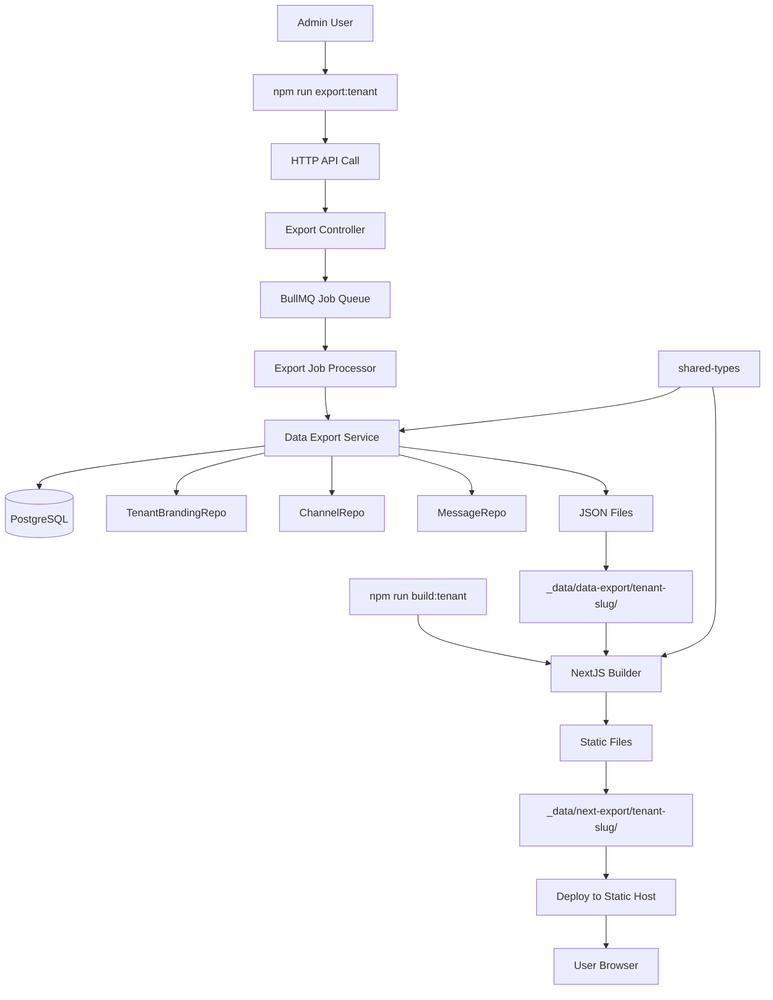

# Design Document

## Overview

The Tenant Static Archive feature generates fully static NextJS websites for each tenant that serve as comprehensive archives of all chat messages. The system consists of three main components: a backend data export job that aggregates tenant data into JSON files, a shared-types package for type safety across components, and a frontend NextJS application that builds static sites from the exported JSON data. This architecture ensures clean separation of concerns with the frontend having no direct database access.

## Architecture

### High-Level Architecture



### Component Integration

The static site generation system consists of three integrated components:

- **Backend Data Export**: Service that runs in the backend, leveraging existing repositories to export tenant data
- **Shared Types Package**: Common TypeScript definitions used by both backend and frontend
- **Frontend NextJS App**: Reads exported JSON files and generates static sites without database access
- **Data Flow**: Backend exports → JSON files → Frontend reads → Static site output

## Components and Interfaces

### 1. Backend Data Export Service

**Purpose**: Backend service that exports all tenant data to structured JSON files for static site generation.

**Interface**:

```typescript
// backend/src/services/dataExport/DataExportService.ts
export interface DataExportService {
  exportAllTenants(): Promise<ExportResult[]>;
  exportTenant(tenantId: string): Promise<ExportResult>;
}

export interface ExportResult {
  tenantId: string;
  tenantSlug: string;
  channelsExported: number;
  messagesExported: number;
  filesGenerated: number;
  exportPath: string;
  executionTimeMs: number;
  errors: string[];
}
```

**Implementation**:

- Triggered via HTTP endpoints or BullMQ jobs
- Loops through all active tenants (or processes a single tenant)
- Uses existing repositories (ChannelRepository, MessageRepository, etc.)
- Fetches tenant branding from TenantBrandingRepository
- Generates paginated JSON files (1000 messages per file)
- Saves output to `_data/data-export/{tenant-slug}/` directory
- Ensures all exported files have open permissions (chmod 777) for container compatibility

### 2. Shared Types Package

**Purpose**: Provides common TypeScript type definitions shared between backend and frontend.

**Package Structure**:

```
shared-types/
├── package.json
├── tsconfig.json
└── src/
    ├── index.ts
    ├── tenant.ts      // Tenant and branding types
    ├── channel.ts     // Channel types
    ├── message.ts     // Message, reaction, attachment types
    └── archive.ts     // Static archive data structures
```

**Key Types**:

```typescript
// shared-types/src/archive.ts
export interface ArchiveMetadata {
  tenant: TenantInfo;
  branding: TenantBranding | null;
  channels: ChannelSummary[];
  generatedAt: string;
  dataVersion: string;
}

export interface ChannelPageData {
  channelId: string;
  channelName: string;
  channelType: ChannelType;
  page: number;
  totalPages: number;
  messages: ArchiveMessage[];
}

export interface ArchiveMessage {
  id: string;
  platformMessageId: string;
  anonymizedAuthorId: string;
  content: string;
  replyToId: string | null;
  platformCreatedAt: string;
  reactions: MessageReaction[];
  attachments: MessageAttachment[];
}
```

### 3. Tenant Data Structure

```typescript
// Main tenant metadata file
export interface TenantMetadata {
  tenant: {
    id: string;
    name: string;
    slug: string;
    platform: Platform;
  };
  branding: {
    logo: string | null; // Base64 encoded image data
    primaryColor: string; // Hex color code
    secondaryColor: string; // Hex color code
    accentColor: string; // Hex color code
  } | null;
  channels: Array<{
    id: string;
    name: string;
    type: ChannelType;
    parentChannelId: string | null;
    messageCount: number;
    totalPages: number;
  }>;
  generatedAt: Date;
}

// Individual channel page data (1000 messages per page)
export interface ChannelPageData {
  channelId: string;
  channelName: string;
  channelType: ChannelType;
  page: number;
  totalPages: number;
  messages: Array<{
    id: string;
    platformMessageId: string;
    anonymizedAuthorId: string;
    content: string;
    replyToId: string | null;
    platformCreatedAt: string; // ISO string for JSON compatibility
    reactions: Array<{
      emoji: string;
      anonymizedUserId: string;
    }>;
    attachments: Array<{
      filename: string;
      fileSize: number; // JSON doesn't support bigint
      contentType: string;
      url: string;
    }>;
  }>;
}
```

### 3. NextJS Static Site Application

**Purpose**: Standalone NextJS application that generates static sites from aggregated tenant data.

**Key Features**:

- Server-side generation (SSG) with all data bundled at build time
- DaisyUI component library for consistent, responsive design
- Default theme for tenants without custom branding
- Channel navigation with different layouts for text/forum/thread channels
- Message threading and reply visualization
- Dicebear avatar generation during build time using anonymized user IDs
- Pagination with 1000 messages per page for optimal performance

**File Structure**:

```
frontend/
├── package.json
├── next.config.js
├── pages/
│   ├── index.tsx                    # Channel list
│   ├── channel/[id]/[page].tsx      # Channel messages (paginated)
│   └── _app.tsx                     # App wrapper
├── components/
│   ├── ChannelList.tsx      # DaisyUI menu and badge components
│   ├── MessageList.tsx      # DaisyUI card and timeline components
│   ├── Message.tsx          # DaisyUI chat bubble and badge components
│   ├── Avatar.tsx           # DaisyUI avatar component
│   ├── Pagination.tsx       # DaisyUI pagination component
│   └── Layout.tsx           # DaisyUI navbar and drawer components
├── lib/
│   ├── data.ts                      # Data loading utilities
│   └── avatars.ts                   # Dicebear integration (client-side)
├── styles/
│   └── globals.css
└── out/                             # NextJS build output (gitignored)

_data/
├── data-export/                     # Backend exported tenant data
│   └── {tenant-slug}/
│       ├── metadata.json            # Tenant and channel metadata
│       └── channels/
│           ├── {channel-id}/
│           │   ├── page-1.json      # First 1000 messages
│           │   ├── page-2.json      # Next 1000 messages
│           │   └── ...
│           └── {another-channel-id}/
│               ├── page-1.json
│               └── ...
└── next-export/                     # Frontend static site output
    └── {tenant-slug}/
        └── ... (NextJS static files)
```

### 4. Avatar Generation in Frontend

**Purpose**: Generate consistent Dicebear avatars during NextJS build time using existing anonymized user IDs.

**Implementation**:

```typescript
// frontend/lib/avatars.ts
import { createAvatar } from '@dicebear/core';
import { shapes } from '@dicebear/collection';

export function generateAvatar(anonymizedUserId: string): string {
  // Use the already-hashed anonymized user ID directly as seed
  const avatar = createAvatar(shapes, {
    seed: anonymizedUserId,
    // Additional styling options can be configured here
  });

  return avatar.toString();
}

// Used in React components during build time
export function AvatarComponent({ userId }: { userId: string }) {
  const avatarSvg = generateAvatar(userId);
  return <div dangerouslySetInnerHTML={{ __html: avatarSvg }} />;
}
```

### 5. HTTP Export API Endpoints

**Purpose**: Provides HTTP endpoints to trigger and monitor data export jobs asynchronously.

**Implementation**:

```typescript
// backend/src/routes/export.ts
export interface ExportRoutes {
  POST: {
    '/api/export/all-tenants': {
      response: { jobIds: string[] }
    };
    '/api/export/tenant/:tenantId': {
      params: { tenantId: string };
      response: { jobId: string }
    };
  };
  GET: {
    '/api/export/status/:jobId': {
      params: { jobId: string };
      response: {
        jobId: string;
        status: 'pending' | 'processing' | 'completed' | 'failed';
        progress?: number; // 0-100
        currentOperation?: string;
        error?: string;
        retryCount?: number;
        executionTimeMs?: number;
        result?: ExportResult;
      }
    };
  };
}

// backend/src/services/export/ExportJobProcessor.ts
export class ExportJobProcessor {
  async processExportTenant(job: Job<ExportTenantJobData>) {
    const { tenantId } = job.data;
    const exportService = new DataExportService();
    return await exportService.exportTenant(tenantId);
  }

  async processExportAllTenants(job: Job<ExportAllTenantsJobData>) {
    const exportService = new DataExportService();
    return await exportService.exportAllTenants();
  }
}
```


## Data Models

### TenantBrandingRepository

**Purpose**: Manages tenant branding configuration for white labeling static archives.

**Interface**:

```typescript
// backend/src/repositories/tenant/TenantBrandingRepository.ts
export interface TenantBrandingRepository {
  findByTenantId(tenantId: string): Promise<TenantBranding | null>;
  create(data: CreateTenantBrandingData): Promise<TenantBranding>;
  update(id: string, data: UpdateTenantBrandingData): Promise<TenantBranding>;
  delete(id: string): Promise<void>;
}
```

### White Labeling Configuration

Tenants can customize their static archive appearance through branding configuration stored in the database:

```typescript
export interface TenantBranding {
  id: string;
  tenantId: string;
  logo: string | null; // Base64 encoded image data
  primaryColor: string; // Hex color code (default: #3b82f6)
  secondaryColor: string; // Hex color code (default: #64748b)
  accentColor: string; // Hex color code (default: #10b981)
  createdAt: Date;
  updatedAt: Date;
}

// Default theme when no branding is configured
export const DEFAULT_THEME = {
  logo: null,
  primaryColor: '#3b82f6',   // Blue
  secondaryColor: '#64748b', // Gray
  accentColor: '#10b981'     // Green
};
```

### Data Export and Build Workflow

The static site generation consists of two phases:

**Phase 1: Backend Data Export**
```bash
# Trigger export via HTTP (npm scripts make these calls)
npm run export:tenants          # Triggers POST /api/export/all-tenants
npm run export:tenant <tenantId> # Triggers POST /api/export/tenant/:tenantId

# Data is exported to _data/data-export/{tenant-slug}/
```

**Phase 2: Frontend Static Site Generation**
```bash
# Build for specific tenant
npm run build:tenant <tenant-slug>  # Builds static site for specific tenant
npm run export:tenant <tenant-slug> # Exports to static files

# Static files are now available in _data/next-export/{tenant-slug}/
```

### Static Site Data Schema

The static site will consume multiple JSON files with a paginated structure:

**metadata.json** (Main tenant and channel metadata):

```json
{
  "tenant": {
    "id": "uuid",
    "name": "Tenant Name",
    "slug": "tenant-slug",
    "platform": "discord"
  },
  "branding": {
    "logo": "data:image/png;base64,iVBORw0KGgoAAAANSUhEUgAAAAEAAAABCAYAAAAfFcSJAAAADUlEQVR42mP8/5+hHgAHggJ/PchI7wAAAABJRU5ErkJggg==",
    "primaryColor": "#3b82f6",
    "secondaryColor": "#64748b",
    "accentColor": "#10b981"
  },
  "channels": [
    {
      "id": "channel-uuid",
      "name": "general",
      "type": "text",
      "parentChannelId": null,
      "messageCount": 150,
      "totalPages": 3
    }
  ],
  "generatedAt": "2024-01-01T12:00:00Z"
}
```

**channels/{channel-id}/page-{n}.json** (Channel message pages, 250 messages each):

```json
{
  "channelId": "channel-uuid",
  "channelName": "general",
  "channelType": "text",
  "page": 1,
  "totalPages": 3,
  "messages": [
    {
      "id": "message-uuid",
      "platformMessageId": "discord-message-id",
      "anonymizedAuthorId": "anon-user-123",
      "content": "Hello world!",
      "replyToId": null,
      "platformCreatedAt": "2024-01-01T12:00:00Z",
      "reactions": [
        {
          "emoji": "👍",
          "anonymizedUserId": "anon-user-456"
        }
      ],
      "attachments": []
    }
  ]
}
```

## Error Handling

### Script Execution Failures

- **Invalid Tenant ID**: Display clear error message and exit gracefully
- **Database Connection Errors**: Log connection details and suggest troubleshooting steps
- **Data Fetching Errors**: Log specific queries that failed, continue with partial data if possible
- **File System Errors**: Check write permissions, ensure data directory exists
- **Out of Memory**: Process data in smaller batches for large tenants

### Build Failures

- **Missing Data Files**: Verify data aggregation completed successfully
- **NextJS Build Errors**: Display build logs with clear error messages
- **Template Errors**: Validate component integrity during development

### Error Handling in Scripts

```typescript
// Example error handling in tenantDataAggregator.ts
try {
  const tenant = await getTenant(tenantId);
  if (!tenant) {
    console.error(`Error: Tenant with ID '${tenantId}' not found`);
    process.exit(1);
  }
  // Continue processing...
} catch (error) {
  console.error('Failed to connect to database:', error);
  console.error('Please check your DATABASE_URL environment variable');
  process.exit(1);
}
```

### Graceful Degradation

- If tenant has no data, generate empty archive with appropriate messaging
- If specific channels fail to process, continue with remaining channels
- If avatar generation fails, use default placeholder avatars
- If build fails completely, preserve previous version if available

## Testing Strategy

### Unit Tests

- **Data Aggregator**: Test data fetching and transformation logic
- **Avatar Service**: Test consistent avatar generation
- **Worker Logic**: Test job processing with mocked dependencies
- **Template Components**: Test React components with sample data

### Integration Tests

- **End-to-End Generation**: Test complete flow from job trigger to static site
- **Database Integration**: Test data fetching with real database
- **NextJS Build**: Test build process with various data scenarios
- **Nginx Routing**: Test static site serving with different tenant slugs

### Test Data Scenarios

- Empty tenant (no channels/messages)
- Single channel with few messages
- Multiple channels with threading
- Large dataset with pagination requirements
- Various channel types (text, forum, thread)
- Messages with attachments and reactions

## Deployment Constraints

### Shared Volume Requirement

The architecture requires that both the backend and frontend have access to a shared filesystem volume:

- Backend writes to `_data/data-export/{tenant-slug}/`
- Frontend reads from `_data/data-export/{tenant-slug}/`
- In Docker deployments, this requires mounting the same volume to both containers
- The `_data` directory must be accessible to both services

### File Permissions

To avoid container permission issues:

```typescript
// In DataExportService after writing files
import { chmod } from 'fs/promises';

// After writing each JSON file
await chmod(filePath, 0o777); // Ensure open permissions
```

## Error Handling and Retry Logic

### Export Job Error Handling

```typescript
export interface ExportJobOptions {
  attempts: 3; // Total number of attempts
  backoff: {
    type: 'exponential';
    delay: 2000; // Initial delay in ms
  };
}

// Job processor handles errors
async processExportTenant(job: Job<ExportTenantJobData>) {
  try {
    const result = await exportService.exportTenant(job.data.tenantId);
    return result;
  } catch (error) {
    // Log error details
    logger.error('Export failed', { 
      jobId: job.id, 
      tenantId: job.data.tenantId, 
      attempt: job.attemptsMade,
      error 
    });
    
    // Store error in job data for status endpoint
    await job.updateData({
      ...job.data,
      lastError: error.message
    });
    
    throw error; // Let BullMQ handle retry
  }
}
```

### Failure Scenarios

1. **Database Connection Failure**: Job retries with exponential backoff
2. **File System Errors**: Check permissions, ensure _data directory exists
3. **Out of Memory**: Process channels in batches, implement streaming
4. **Partial Export Failure**: Log which channels failed, continue with others

## Build Optimization Notes

- Process data in streaming fashion for large tenants to avoid memory issues
- Build each tenant's static site independently
- Use efficient JSON parsing for large data files
- Implement pagination to handle channels with many messages
- Ensure proper file permissions (0o777) for all exported files
