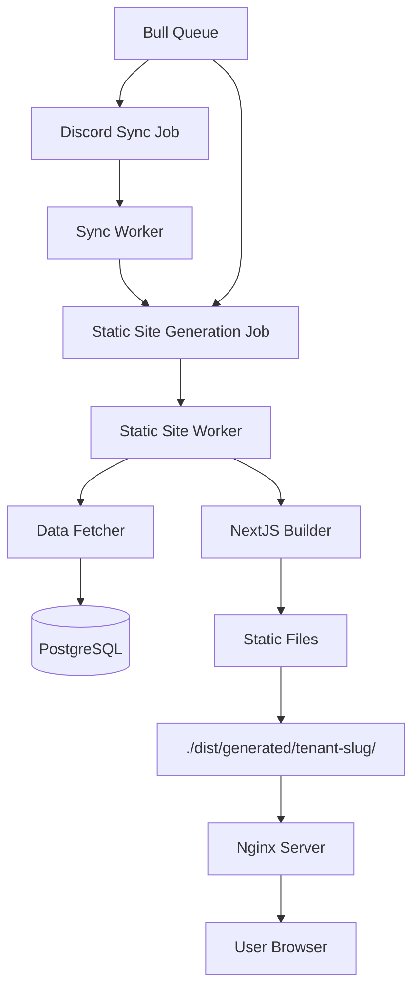

# Design Document

## Overview

The Tenant Static Archive feature generates fully static NextJS websites for each tenant that serve as comprehensive archives of all chat messages. The system integrates with the existing multi-tenant architecture, leveraging the current sync infrastructure to trigger static site generation jobs after Discord sync completion. Each tenant gets a dedicated static website accessible via their slug, served through an nginx container.

## Architecture

### High-Level Architecture



### Component Integration

The static site generation system integrates with existing components:

- **Sync Worker**: Modified to schedule static site generation jobs upon successful completion
- **Bull Queue System**: Extended with a new queue for static site generation jobs
- **Repository Layer**: Utilized to fetch tenant data for static site generation
- **Docker Compose**: Extended with nginx container for serving static sites

## Components and Interfaces

### 1. Static Site Generation Queue

**Purpose**: Manages static site generation jobs using the existing Bull/Redis infrastructure.

**Interface**:

```typescript
export interface StaticSiteJobData {
  tenantId: string;
  tenantSlug: string;
  force?: boolean; // Force regeneration even if up-to-date
}

export interface StaticSiteJobResult {
  tenantId: string;
  tenantSlug: string;
  generatedAt: Date;
  filesGenerated: number;
  buildTimeMs: number;
  errors: Array<{
    error: string;
    timestamp: Date;
  }>;
}
```

**Implementation**:

- New queue `STATIC_SITE_QUEUE_NAME = 'static-site-generation'`
- Similar configuration to existing sync queue
- Jobs triggered automatically after successful sync completion

### 2. Static Site Worker

**Purpose**: Processes static site generation jobs by fetching tenant data and building NextJS sites.

**Key Responsibilities**:

- Fetch all tenant data (channels, messages, reactions, attachments)
- Generate static data files for NextJS consumption
- Execute NextJS build process
- Store generated files in tenant-specific directories

**Interface**:

```typescript
export class StaticSiteWorker {
  async processSiteGenerationJob(
    job: Job<StaticSiteJobData>
  ): Promise<StaticSiteJobResult>;
  private async fetchTenantData(tenantId: string): Promise<TenantArchiveData>;
  private async generateStaticSite(
    tenantData: TenantArchiveData,
    outputPath: string
  ): Promise<void>;
  private async buildNextJSSite(sitePath: string): Promise<void>;
}
```

### 3. Tenant Data Aggregator

**Purpose**: Aggregates all tenant data into a structured format suitable for static site generation.

**Data Structure**:

```typescript
// Main tenant metadata file
export interface TenantMetadata {
  tenant: {
    id: string;
    name: string;
    slug: string;
    platform: Platform;
  };
  branding: {
    logo: string | null; // Base64 encoded image data
    primaryColor: string; // Hex color code
    secondaryColor: string; // Hex color code
    accentColor: string; // Hex color code
  } | null;
  channels: Array<{
    id: string;
    name: string;
    type: ChannelType;
    parentChannelId: string | null;
    messageCount: number;
    totalPages: number;
  }>;
  generatedAt: Date;
}

// Individual channel page data (250 messages per page)
export interface ChannelPageData {
  channelId: string;
  channelName: string;
  channelType: ChannelType;
  page: number;
  totalPages: number;
  messages: Array<{
    id: string;
    platformMessageId: string;
    anonymizedAuthorId: string;
    content: string;
    replyToId: string | null;
    platformCreatedAt: Date;
    reactions: Array<{
      emoji: string;
      anonymizedUserId: string;
    }>;
    attachments: Array<{
      filename: string;
      fileSize: bigint;
      contentType: string;
      url: string;
    }>;
  }>;
}
```

### 4. NextJS Static Site Template

**Purpose**: Provides the NextJS application template that renders the archived chat data.

**Key Features**:

- Server-side generation (SSG) with all data bundled at build time
- DaisyUI component library for consistent, responsive design
- Channel navigation with different layouts for text/forum/thread channels
- Message threading and reply visualization
- Dicebear avatar integration with consistent hashing
- Pagination with 250 messages per page for optimal performance

**File Structure**:

```
template/
├── package.json
├── next.config.js
├── pages/
│   ├── index.tsx                    # Channel list
│   ├── channel/[id]/[page].tsx      # Channel messages (paginated)
│   └── _app.tsx                     # App wrapper
├── components/
│   ├── ChannelList.tsx      # DaisyUI menu and badge components
│   ├── MessageList.tsx      # DaisyUI card and timeline components
│   ├── Message.tsx          # DaisyUI chat bubble and badge components
│   ├── Avatar.tsx           # DaisyUI avatar component
│   ├── Pagination.tsx       # DaisyUI pagination component
│   └── Layout.tsx           # DaisyUI navbar and drawer components
├── lib/
│   ├── data.ts                      # Data loading utilities
│   └── avatars.ts                   # Dicebear integration
├── styles/
│   └── globals.css
└── data/
    ├── metadata.json                # Tenant and channel metadata
    └── channels/
        ├── {channel-id}/
        │   ├── page-1.json          # First 250 messages
        │   ├── page-2.json          # Next 250 messages
        │   └── ...
        └── {another-channel-id}/
            ├── page-1.json
            └── ...
```

### 5. Avatar Generation Service

**Purpose**: Generates consistent Dicebear avatars using the "shapes" style via the NPM library.

**Implementation**:

```typescript
import { createAvatar } from '@dicebear/core';
import { shapes } from '@dicebear/collection';
import { createHash } from 'crypto';

export class AvatarService {
  static generateAvatarSvg(anonymizedUserId: string): string {
    // Use anonymized user ID as seed for consistent avatars
    const seed = createHash('md5').update(anonymizedUserId).digest('hex');

    const avatar = createAvatar(shapes, {
      seed,
      // Additional styling options can be configured here
    });

    return avatar.toString();
  }

  static generateAvatarDataUrl(anonymizedUserId: string): string {
    const svg = this.generateAvatarSvg(anonymizedUserId);
    const base64 = Buffer.from(svg).toString('base64');
    return `data:image/svg+xml;base64,${base64}`;
  }
}
```

### 6. Nginx Configuration

**Purpose**: Serves static sites based on tenant slugs with proper routing and error handling.

**Configuration**:

```nginx
server {
    listen 80;
    server_name localhost;

    location ~ ^/([^/]+)/?(.*)$ {
        set $tenant_slug $1;
        set $path $2;

        root /var/www/generated/$tenant_slug;

        # Try to serve the file, fallback to index.html for SPA routing
        try_files /$path /$path/ /index.html =404;

        # Handle missing tenant directories
        if (!-d /var/www/generated/$tenant_slug) {
            return 404;
        }
    }

    # Health check endpoint
    location /health {
        return 200 "OK";
    }
}
```

## Data Models

### White Labeling Configuration

Tenants can customize their static archive appearance through branding configuration stored in the database:

```typescript
export interface TenantBranding {
  id: string;
  tenantId: string;
  logo: string | null; // Base64 encoded image data
  primaryColor: string; // Hex color code
  secondaryColor: string; // Hex color code
  accentColor: string; // Hex color code
  createdAt: Date;
  updatedAt: Date;
}
```

### Extended Sync Job Integration

The existing `SyncWorker` will be modified to schedule static site generation jobs:

```typescript
// In SyncWorker.processSyncJob()
if (result.errors.length === 0) {
  // Schedule static site generation job
  await staticSiteQueue.add('generate-site', {
    tenantId: tenant.id,
    tenantSlug: tenant.slug,
  });
}
```

### Static Site Data Schema

The static site will consume multiple JSON files with a paginated structure:

**metadata.json** (Main tenant and channel metadata):

```json
{
  "tenant": {
    "id": "uuid",
    "name": "Tenant Name",
    "slug": "tenant-slug",
    "platform": "discord"
  },
  "branding": {
    "logo": "data:image/png;base64,iVBORw0KGgoAAAANSUhEUgAAAAEAAAABCAYAAAAfFcSJAAAADUlEQVR42mP8/5+hHgAHggJ/PchI7wAAAABJRU5ErkJggg==",
    "primaryColor": "#3b82f6",
    "secondaryColor": "#64748b",
    "accentColor": "#10b981"
  },
  "channels": [
    {
      "id": "channel-uuid",
      "name": "general",
      "type": "text",
      "parentChannelId": null,
      "messageCount": 150,
      "totalPages": 3
    }
  ],
  "generatedAt": "2024-01-01T12:00:00Z"
}
```

**channels/{channel-id}/page-{n}.json** (Channel message pages, 250 messages each):

```json
{
  "channelId": "channel-uuid",
  "channelName": "general",
  "channelType": "text",
  "page": 1,
  "totalPages": 3,
  "messages": [
    {
      "id": "message-uuid",
      "platformMessageId": "discord-message-id",
      "anonymizedAuthorId": "anon-user-123",
      "content": "Hello world!",
      "replyToId": null,
      "platformCreatedAt": "2024-01-01T12:00:00Z",
      "reactions": [
        {
          "emoji": "👍",
          "anonymizedUserId": "anon-user-456"
        }
      ],
      "attachments": []
    }
  ]
}
```

## Error Handling

### Build Failures

- **Data Fetching Errors**: Retry with exponential backoff, log specific database errors
- **NextJS Build Errors**: Capture build logs, provide fallback empty site generation
- **File System Errors**: Ensure proper permissions, handle disk space issues
- **Template Errors**: Validate template integrity before build process

### Runtime Error Handling

```typescript
export class StaticSiteError extends Error {
  constructor(
    message: string,
    public readonly tenantId: string,
    public readonly phase: 'data-fetch' | 'build' | 'deploy',
    public readonly originalError?: Error
  ) {
    super(message);
    this.name = 'StaticSiteError';
  }
}
```

### Graceful Degradation

- If tenant has no data, generate empty archive with appropriate messaging
- If specific channels fail to process, continue with remaining channels
- If avatar generation fails, use default placeholder avatars
- If build fails completely, preserve previous version if available

## Testing Strategy

### Unit Tests

- **Data Aggregator**: Test data fetching and transformation logic
- **Avatar Service**: Test consistent avatar generation
- **Worker Logic**: Test job processing with mocked dependencies
- **Template Components**: Test React components with sample data

### Integration Tests

- **End-to-End Generation**: Test complete flow from job trigger to static site
- **Database Integration**: Test data fetching with real database
- **NextJS Build**: Test build process with various data scenarios
- **Nginx Routing**: Test static site serving with different tenant slugs

### Test Data Scenarios

- Empty tenant (no channels/messages)
- Single channel with few messages
- Multiple channels with threading
- Large dataset with pagination requirements
- Various channel types (text, forum, thread)
- Messages with attachments and reactions

### Performance Testing

- **Build Time**: Measure generation time for various data sizes
- **Memory Usage**: Monitor memory consumption during build process
- **Concurrent Jobs**: Test multiple static site generations simultaneously
- **Static Site Performance**: Measure load times and navigation speed

## Security Considerations

### Data Privacy

- All user IDs remain anonymized in static sites
- No platform-specific identifiers exposed in generated sites
- Attachment URLs may need proxy/caching strategy for privacy

### Access Control

- Static sites are publicly accessible once generated
- No authentication required for viewing archives
- Consider tenant-level privacy settings for future enhancement

### File System Security

- Generated files stored in isolated tenant directories
- Proper file permissions to prevent cross-tenant access
- Input validation for tenant slugs to prevent directory traversal

## Performance Optimization

### Build Performance

- **Full Regeneration**: Always perform complete rebuilds to maintain simplicity and consistency
- **Parallel Processing**: Process multiple channels concurrently
- **Memory Management**: Stream large datasets to avoid memory issues
- **Build Optimization**: Optimize NextJS build process for faster generation

### Static Site Performance

- **Code Splitting**: Split JavaScript bundles by route
- **Image Optimization**: Optimize avatar images and attachments
- **Lazy Loading**: Implement virtual scrolling for large message lists

### Storage Optimization

- **Compression**: Gzip static assets
- **Asset Deduplication**: Share common assets between tenant sites
- **Cleanup**: Remove old generated sites based on retention policy
